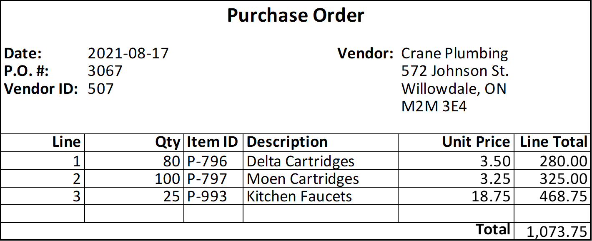
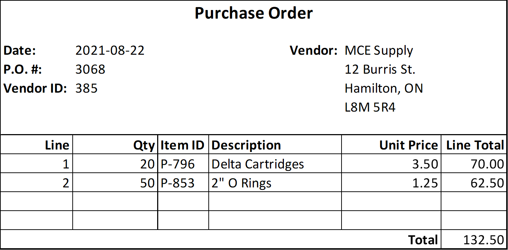

**Normalization:**
 - data organization and simplification
 - could make data mode complex - more tables
 - could make query more complex - more joins

**Dependency:**
 - Restaruant --> Dish, Restaruant --> Delivery Area, Dish -× Delivery Area (4NF unsatisfied)
   - 2 Functional Dependencies (FD), 1 Transitive Dependencies (TD) as Rest.-->DArea
 - Salesman --> Product, Salesman --> Product brand, Brand --> Product (5NF unsatisfied)
   - 3FD, 2TD

**0th Normal Form (0NF):**
 - un-normalized model - multiple-to-1 mapping
 - calculated values in the same table w/ supporting data

|     STU_NO    |     FEE                           |     PAID             |     AMOUNT                          |
|---------------|-----------------------------------|----------------------|-------------------------------------|
|     302910    |     Co-op     Parking     Food    |     Y     N     Y    |     400.00     150.00     100.00    |
|     319825    |     Parking     Food              |     Y     Y          |     150.00     100.00               |
|     327447    |     Food                          |     Y                |     100.00                          |
|     349223    |     Parking     Food              |     Y     N          |     150.00     100.00               |

**1st Normal Form (1NF):**
 - does not eliminate redundancy, but rather eliminate repeating groups
 - ×duplicated mapping - √1 to 1 mapping (columns are still multi-valued)
 - lack of PK

|     STU_NO                          |     FEE                           |     PAID             |     AMOUNT                          |
|-------------------------------------|-----------------------------------|----------------------|-------------------------------------|
|     302910     302910     302910    |     Co-op     Parking     Food    |     Y     N     Y    |     400.00     150.00     100.00    |
|     319825     319825               |     Parking     Food              |     Y     Y          |     150.00     100.00               |
|     327447                          |     Food                          |     Y                |     100.00                          |
|     349223     349223               |     Parking     Food              |     Y     N          |     150.00     100.00               |

**Explain anomaly:**
 - An inconsistency of data (e.g., payment becomes w/out ID) resulting from update, insertion, or deletion == the 3 types of anomalies
 - Update & Deletion anomalies are very frequent if database is not normalized

**If the information on STU_NO 302910 is dropped, a deletion anomaly arises. What does this mean?**
 - Information lost - Amount for Co-op

**Types of 1NF anomalies:**
 - update
 - deletion
 - insertion

**Explain update anomaly:**
 - If we update address on 1 row under table below, update anomaly arises (2 different addresses for the same person)
 
| 002 | Tom | 11, VA Street, New York | B |
|-----|-----|-------------------------|---|
| 003 | Tom | 11, VA Street, New York | C |

**2nd Normal Form (2NF):**
 - remove attributes that are not dependent on whole PK (but composite keys)
 - 2 relations are introduced:
  - key to PK
  - key to Composite Keys (relate both with PK & other key)

|     STU_NO    |     FEE        |     PAID    |     AMOUNT    |
|---------------|----------------|-------------|---------------|
|     302910    |     Co-op      |     Y       |     400.00    |
|     302910    |     Parking    |     N       |     150.00    |
|     302910    |     Food       |     Y       |     100.00    |
|     319825    |     Parking    |     Y       |     150.00    |
|     319825    |     Food       |     Y       |     100.00    |
|     327447    |     Food       |     Y       |     100.00    |
|     349223    |     Parking    |     Y       |     150.00    |
|     349223    |     Food       |     N       |     100.00    |

**Types of 2NF anomalies:**
 - insertion (cannot insert a new item without corresponding attribute from it)
 - deletion (deleting item attribute will cause data loss of the distributor)
 - update (phone number col. gets duplicated by amount of purchases)
   - less vulnerble than 1NF, however

**Explain Super Key & Candidate Key**
 - A set of one or more attributes (columns), which can uniquely identify a row in a table (forming FD)
 - Candidate key is selected from the set of super keys
   - CK should not have redundant attribute - minimal super key
 - Example: all 3 column headings are super keys
   - SKs: {Emp_SSN}, {Emp_Number}, {Emp_SSN, Emp_Number}, {Emp_SSN, Emp_Name}, {Emp_SSN, Emp_Number, Emp_Name}, {Emp_Number, Emp_Name}
   - Minimalized SKs becomes cadidates - {Emp_SSN}, {Emp_Number}

| Emp_SSN   | Emp_Number | Emp_Name  |
|-----------|------------|-----------|
| 123456789 | 226        | Steve     |
| 999999321 | 227        | Ajeet     |
| 888997212 | 228        | Chaitanya |
| 777778888 | 229        | Robert    |

**3rd Normal Form (3NF):**
 - filtering: functionally dependent SOLELY on the PK, miltu-dependances are moved to other tables
 - ×transitive dependency (TD) for non-PKs - split table if unsatisfied

**Explain transitive dependency (TD):**
 - If A-->B, B-->C are 2 functional dependencies (FD), then A--(TD)->C

**Example of 0~3NF + ERD:**

 - Keys: Order date, P.O. #, Vendor ID, Vendor name, Address, City, Prov, Postal, Purchase line, Qty, Item ID, Item name, Unit price, Line total, Total

 - **0NF:** multiple-to-1 mapping:

 - **1NF:** 1-to-1 mapping, calculated value (Line total, total) removed:

 - **2NF:** Find Functional Dependencies (FDs)
   - *Keys dependent on PO_No:*
      - Order_date
      - Vendor_ID
      - Name
      - Address, City, Prov, Postal
   - *Keys dependent on {PO_No, Line}*
      - Qty
      - Item ID
      - Description
      - Price
   - Create 2NF table by splitting 1NF based on these values:

 - **3NF:** Removal of multi-dependace
   - `[dbo.PO_headers]` = {PO_No} {Order_date} {Vendor_ID}
   - `[dbo.Vendors]`       = {Vendor_ID} {Name} {Address} {City} {Prov} {Postal}
   - `[dbo.Items]`           = {Item_ID} {Description} {Price}
   - `[dbo.PO_lines]`      = {PO_No} {Line} {Qty} {Item_ID}
 
 - **Creating ERD out of 3NF**
   - `[dbo.PO_headers]` = PK{PO_No} {Order_date} FK{Vendor_ID}
   - `[dbo.Vendors]`       = PK{Vendor_ID} {Name} {Address} {City} {Prov} {Postal}
   - `[dbo.Items]`           = PK{Item_ID} {Description} {Price}
   - `[dbo.PO_lines]`      = PKFK{PO_No} {Line} {Qty} FK2{Item_ID}

   - `[dbo.PO_headers]` one to many towards `[dbo.PO_lines]`
   - `[dbo.Vendors]`       one to many towards `[dbo.PO_headers]`
   - `[dbo.Items]`           one to many towards `[dbo.PO_lines]`
   - `[dbo.PO_lines]`     

**Online Transaction Processing (OLTP)**
 - Emphasizes speed and simplicity of access over data integrity
   - Explicitly de-normalized for this purpose
   - Also known as Big Data, Data Warehouse
 - Business Intelligence (BI) tools work with OLAP data to provide end users with the ability to analyze and report 
   - Data in an OLAP database is often conceptualized around the concept of a cube
   - BI tools allow slicing, dicing, drilling down
    - Data analysis by "click chart to zoom" topology

**Boyce Codd Normal Form (BCNF, 3.5NF):**
 - ×non-trivial dependency (PK-Key is not the only possible relationship of a key) 

**4th Normal Form (4NF):**
 - ×multivalued dependency
 - e.g., 3 columns are duplicating themselves to satisfy varible from other other 2 columns - split table into 2, based on most duplicated column)

**5th Normal Form (5NF):**
 - Data before 4NF that has complete dependency that cannot be formatted
 - Split into N tables (Table[a|b|c]: T[a|b], T[b|c], T[a|c])

**Domain Key Normal Form (DKNF):**
 - Domain constraint is on scope of permissible values
 - Key constraint is on scope of row
 - To avoid having general constraints in database
 - instead of apply constraint on table, write the condition onto a swparate table and choose not to put the condition wording into column title.
 - e.g., [Wealthy Person, Type cst{billinaire, millionare}, Networth] to [Wealthy Person, Networth][Type, min, max]